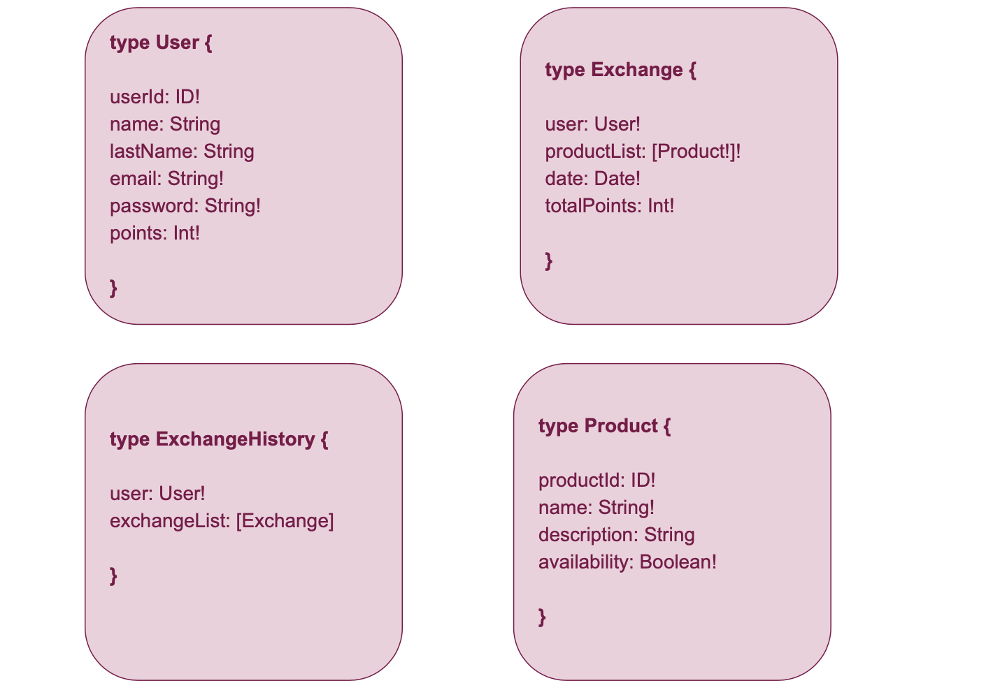

# POA

Trabajo práctico para la materia `Programación con objetos avanzada` de la Facultad de Ingeniería de la Universidad de Palermo. _[ Primer cuatrimestre - 2021 ]_

 

Integrantes: 
- Natalia Bellosi
- Tomas Winiki

 

# **Sistema de gestión de premios por fidelidad**
Requerimientos: 
- El usuario deberá autenticar su identidad para ingresar al sistema.
- El usuario podrá seleccionar de un listado de productos uno, o más, que desee canjear por un monto de puntos.
- El sistema validará si los puntos acumulados por el usuario son suficientes para realizar el canje deseado.
- El usuario administrador podrá crear, editar y eliminar productos del sistema. 

 

# Tecnologías

### **Firebase** 
_[ base de datos ]_
 

Esta plataforma cloud gratuita nos brinda diferentes servicios que agilizan y simplifican tareas escenciales a la hora de desarrollar nuestro sistema. Haremos uso de los servicios
- **Auth** ya que permite la autenticación de un usuario y permanencia de sesión de una forma sencilla
- **Realtime Database** nos brinda una base de datos no relacional con una interfaz gráfica muy intuitiva para los usuarios y fácil a la hora de crear nuestro modelo de datos que además envía notificaciones a las aplicaciones cuando los datos cambian lo que nos permite tener una consistencia de datos constante en nuestro servicio especialmente en casos donde se necesita conocer la disponibilidad de un producto a la hora de realizar el canje
- **Cloud Functions** herrmienta que nos permitirá conectar con la interfaz GraphQL y levantar los datos requeridos. 

 

### **GraphQL** 
_[ lenguaje de consulta ]_
 

La utilización de esta interfaz para la consulta y manipulación de datos nos agilizará los tiempos de respuesta al cliente ya que es una única consulta la que realiza. Al recibir la información específica de lo que necesita mostrar al usuario también tendrá impacto en la resolución front-end.

 

### **NodeJs** 
_[ entorno JavaScript ]_
 

Para poder utilizar GraphQL el proyecto estará levantado sobre un entorno de ejecución del lado servidor en Javascript. Para ello seleccionamos Node.js ya que es uno de los más populares y open-source, además de incluir npm, el gestor de paquetes que nos permite incluir modulos facilmente en nuestro proyecto, agilizando el desarrollo del sistema ampliamente. 

 

# Modelo de Datos

 

# Esquema GraphQL

 

# Diagrama de Clases

